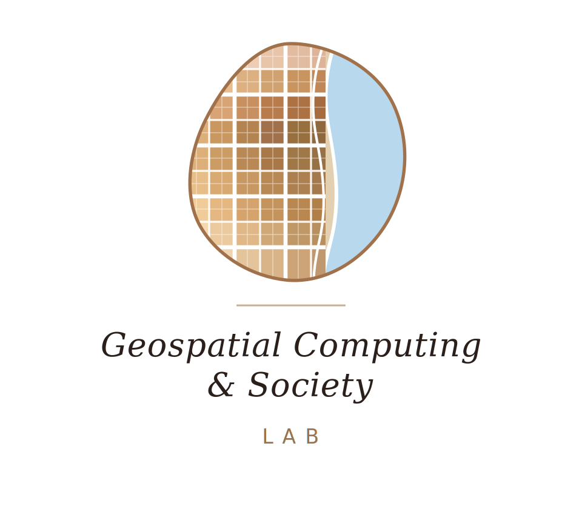
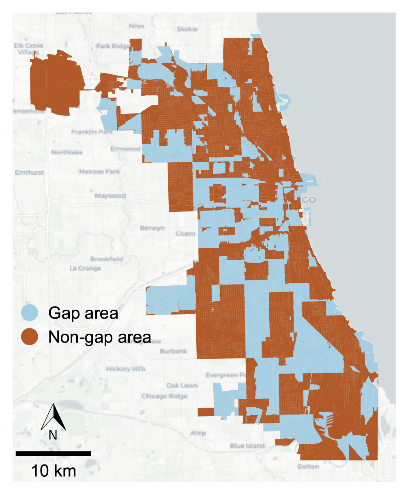
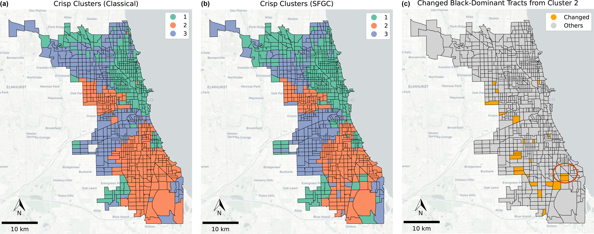
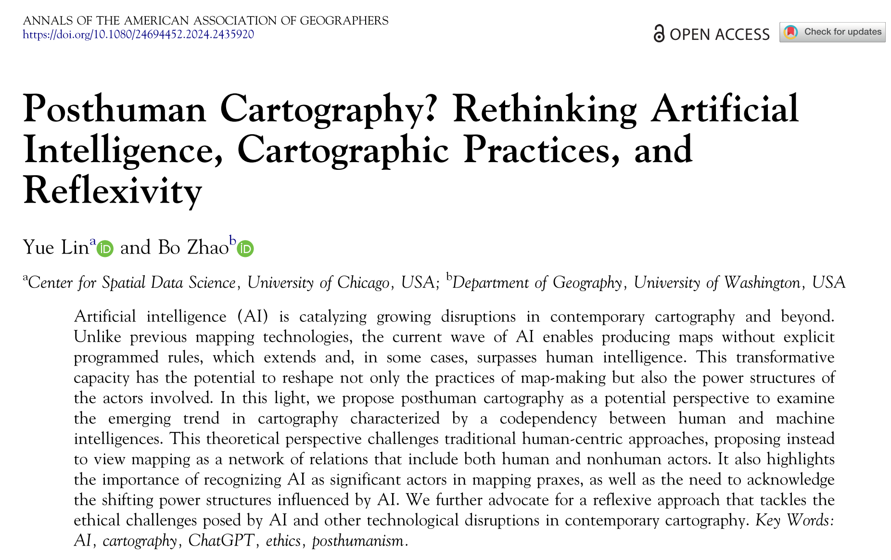
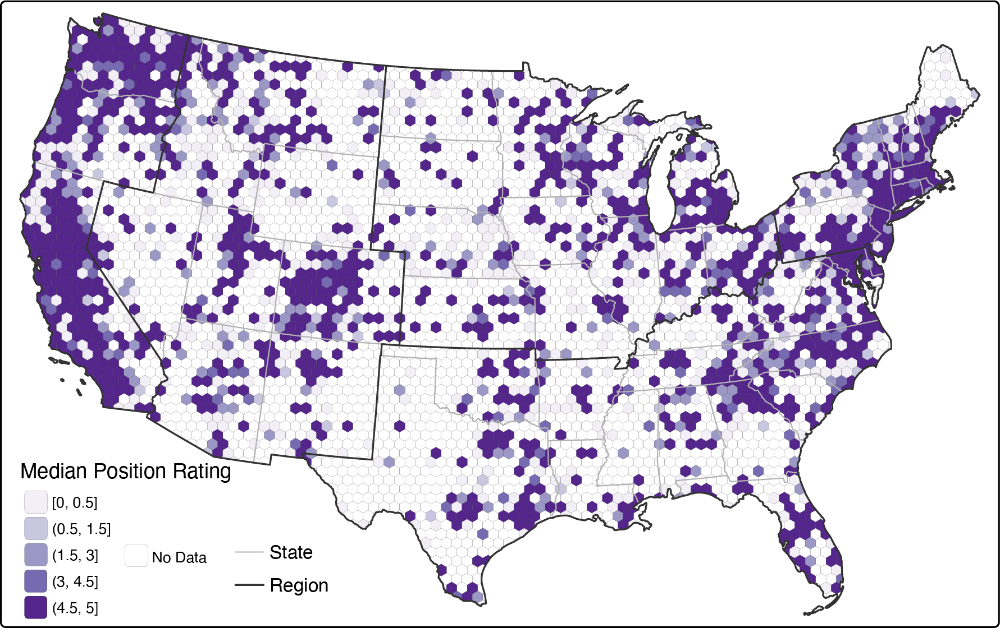

  The Geospatial 
  Computing and 
  Society Lab studies how geospatial technologies are designed, deployed, and governed, with a focus on their social consequences and possibilities for more just futures. Our research spans spatial data science, geospatial artificial intelligence, and critical GIS, and pursues two interconnected directions: (1) developing computational and AI methods that explicitly account for issues such as location privacy and spatial inequalities across data systems, algorithmic models, and policy contexts; and (2) critically examining the social, political, and ethical implications of emerging geospatial technologies (e.g., GeoAI) and envisioning alternative ways these systems can be designed, governed, and used.

**We're looking for prospective graduate and undergraduate students** interested in the intersections of spatial data science, GeoAI, spatial and social inequalities, and critical GIS. Prospective graduate students are encouraged to email me with their CV and review the GGIS Graduate Programs [application page](https://ggis.illinois.edu/academics/graduate-programs/apply). 

**Recent Projects**

  

    
    

      
Limits of Generative AI for Spatial Cognition

      <a href="https://journals.sagepub.com/doi/10.1177/23998083251369570">Read more →</a>
    

  

  

    
    

      
Socially Fair Geodemographic Clustering

      <a href="https://www.tandfonline.com/doi/full/10.1080/13658816.2024.2444525">Read more →</a>
    

  

  

    
    

      
Posthuman Cartography

      <a href="https://www.tandfonline.com/doi/full/10.1080/24694452.2024.2435920">Read more →</a>
    

  

  

    
    

      
Geospatial Crowdsensing and Location Privacy

      <a href="https://doi.org/10.1080/00330124.2026.2656680">Read more →</a>
    

  

**Current Members**
<!-- -->

- **Angela Li**: Honors Thesis Student @ UIUC 
- **Emma Chen**: NCSA SPIN Summer Intern @ UIUC

**Past Members**
<!-- -->

Janice Mei, Oviya Muthukumaran, Ashlynn Wimer, Qian Fang Yeap, Enrico Madani, Na Nguyen, Marcus Kuo, Yassir Atlas, Helen Michael
